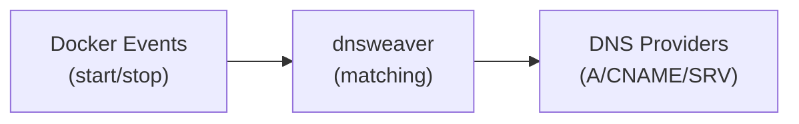

# dnsweaver

[](https://github.com/maxfield-allison/dnsweaver/releases)
[](https://hub.docker.com/r/maxamill/dnsweaver)
[](LICENSE)
[](go.mod)

**Automatic DNS record management for Docker containers with multi-provider support.**

dnsweaver watches Docker events and automatically creates and deletes DNS records for services with reverse proxy labels (Traefik, etc.). Unlike single-provider tools, dnsweaver supports **split-horizon DNS** and **multiple DNS providers** simultaneously.

📚 **[Full Documentation](https://maxfield-allison.github.io/dnsweaver/)**

## Features

- 🔀 **Multi-Provider Support** — Route different domains to different DNS providers
- 🌐 **Split-Horizon DNS** — Internal and external records from the same container labels
- 🐳 **Docker & Swarm Native** — Works with standalone Docker and Docker Swarm clusters
- 🔒 **Socket Proxy Compatible** — Connect via TCP to a Docker socket proxy for improved security
- 🏷️ **Traefik Integration** — Parses `traefik.http.routers.*.rule` labels to extract hostnames
- 📊 **Observable** — Prometheus metrics, health endpoints, structured logging
- 🔑 **Secrets Support** — Docker secrets compatible via `_FILE` suffix variables

## Supported Providers

| Provider | Record Types | Notes |
|----------|--------------|-------|
| [Technitium](https://maxfield-allison.github.io/dnsweaver/providers/technitium/) | A, AAAA, CNAME, SRV, TXT | Full-featured self-hosted DNS |
| [Cloudflare](https://maxfield-allison.github.io/dnsweaver/providers/cloudflare/) | A, AAAA, CNAME, TXT | With optional proxy support |
| [Pi-hole](https://maxfield-allison.github.io/dnsweaver/providers/pihole/) | A, AAAA, CNAME | API or file mode |
| [dnsmasq](https://maxfield-allison.github.io/dnsweaver/providers/dnsmasq/) | A, AAAA, CNAME | File-based configuration |
| [Webhook](https://maxfield-allison.github.io/dnsweaver/providers/webhook/) | Any | Custom integrations |

## Quick Start

### Installation

```bash
# Docker Hub
docker pull maxamill/dnsweaver:latest

# GitHub Container Registry
docker pull ghcr.io/maxfield-allison/dnsweaver:latest
```

### Basic Example

```yaml
services:
  dnsweaver:
    image: maxamill/dnsweaver:latest
    restart: unless-stopped
    environment:
      - DNSWEAVER_INSTANCES=internal-dns
      - DNSWEAVER_INTERNAL_DNS_TYPE=technitium
      - DNSWEAVER_INTERNAL_DNS_URL=http://dns.internal:5380
      - DNSWEAVER_INTERNAL_DNS_TOKEN_FILE=/run/secrets/technitium_token
      - DNSWEAVER_INTERNAL_DNS_ZONE=home.example.com
      - DNSWEAVER_INTERNAL_DNS_RECORD_TYPE=A
      - DNSWEAVER_INTERNAL_DNS_TARGET=10.0.0.100
      - DNSWEAVER_INTERNAL_DNS_DOMAINS=*.home.example.com
    volumes:
      - /var/run/docker.sock:/var/run/docker.sock:ro
    secrets:
      - technitium_token

secrets:
  technitium_token:
    external: true
```

### How It Works



1. A container starts with a Traefik label:
   ```yaml
   labels:
     - "traefik.http.routers.myapp.rule=Host(`myapp.home.example.com`)"
   ```

2. dnsweaver extracts the hostname and matches it against configured provider domain patterns

3. The matching provider creates the DNS record:
   - **A record**: `myapp.home.example.com → 10.0.0.100`
   - **CNAME**: `myapp.example.com → proxy.example.com`

4. When the container stops, the DNS record is automatically cleaned up

## Documentation

| Topic | Description |
|-------|-------------|
| [Getting Started](https://maxfield-allison.github.io/dnsweaver/getting-started/) | Installation and first configuration |
| [Configuration](https://maxfield-allison.github.io/dnsweaver/configuration/environment/) | Environment variables reference |
| [Providers](https://maxfield-allison.github.io/dnsweaver/providers/) | Provider-specific setup guides |
| [Split-Horizon DNS](https://maxfield-allison.github.io/dnsweaver/deployment/split-horizon/) | Internal + external records |
| [Docker Swarm](https://maxfield-allison.github.io/dnsweaver/deployment/swarm/) | Swarm deployment guide |
| [Observability](https://maxfield-allison.github.io/dnsweaver/observability/) | Metrics, logging, and health checks |
| [FAQ](https://maxfield-allison.github.io/dnsweaver/faq/) | Common questions and troubleshooting |

## Split-Horizon DNS Example

Manage internal and external DNS from the same container labels:

```yaml
environment:
  - DNSWEAVER_INSTANCES=internal,external

  # Internal: Technitium → private IP
  - DNSWEAVER_INTERNAL_TYPE=technitium
  - DNSWEAVER_INTERNAL_RECORD_TYPE=A
  - DNSWEAVER_INTERNAL_TARGET=10.0.0.100
  - DNSWEAVER_INTERNAL_DOMAINS=*.example.com

  # External: Cloudflare → tunnel CNAME
  - DNSWEAVER_EXTERNAL_TYPE=cloudflare
  - DNSWEAVER_EXTERNAL_RECORD_TYPE=CNAME
  - DNSWEAVER_EXTERNAL_TARGET=tunnel.example.com
  - DNSWEAVER_EXTERNAL_DOMAINS=*.example.com
```

With this configuration, when `app.example.com` starts:
- Internal DNS → `A` record → `10.0.0.100`
- External DNS → `CNAME` record → `tunnel.example.com`

## Contributing

Contributions are welcome! See [CONTRIBUTING](https://maxfield-allison.github.io/dnsweaver/contributing/) for guidelines.

## License

[MIT License](LICENSE)
