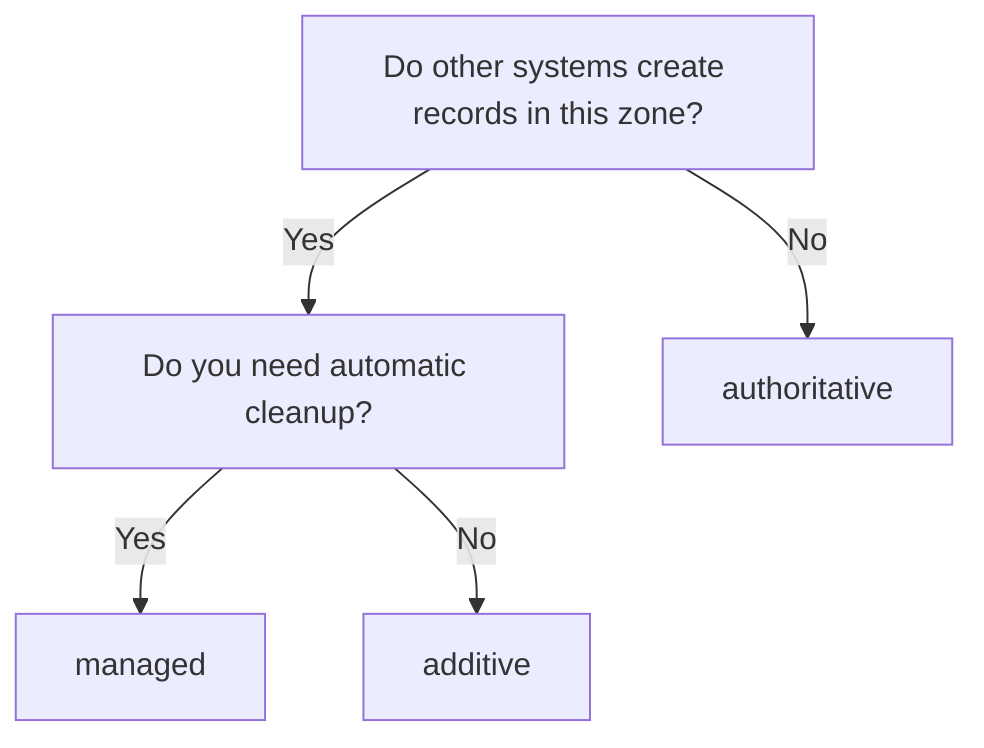

# Operational Modes

Each provider instance can operate in one of three modes, controlling how aggressively dnsweaver manages DNS records. Set via `DNSWEAVER_{NAME}_MODE` or the `mode` field in YAML configuration.

## Mode Comparison

| Mode | Creates Records | Deletes Own Records | Deletes Unknown Records |
|------|:---------------:|:-------------------:|:-----------------------:|
| `managed` (default) | ✅ | ✅ | ❌ |
| `authoritative` | ✅ | ✅ | ✅ |
| `additive` | ✅ | ❌ | ❌ |

## Managed Mode (Default)

**Behavior:** dnsweaver creates and manages records it owns, leaving all other records untouched.

```yaml
- name: internal
  type: technitium
  mode: managed  # default, can be omitted
```

**When to use:**

- Most deployments — safe default
- Shared zones with manually-created records
- Testing and development environments

**How ownership works:**

When `ownership_tracking: true` (default), dnsweaver creates a TXT record alongside each DNS record to track ownership:

```
app.home.example.com       A      10.0.0.100
_dnsweaver.app.home.example.com  TXT    "dnsweaver-id=abc123"
```

Only records with matching TXT ownership records are deleted when containers stop.

## Authoritative Mode

!!! warning "Use with Caution"
    Authoritative mode deletes any record it doesn't recognize. Only use this for zones exclusively managed by dnsweaver.

**Behavior:** dnsweaver takes full ownership of the zone. Records not managed by dnsweaver are deleted.

```yaml
- name: internal
  type: technitium
  mode: authoritative
  domains:
    - "*.apps.internal.example.com"  # Only use on dedicated subdomains
```

**When to use:**

- Dedicated zones exclusively for container DNS
- Automated environments where manual records shouldn't exist
- GitOps workflows where DNS should match container state exactly

**Safeguards:**

- Only affects records matching the provider's domain patterns
- TXT ownership records are still created for audit trail
- Dry-run mode (`DNSWEAVER_DRY_RUN=true`) logs what would be deleted

## Additive Mode

**Behavior:** dnsweaver only creates records, never deletes them — even for stopped containers.

```yaml
- name: public-dns
  type: cloudflare
  mode: additive
```

**When to use:**

- Migration scenarios — gradually adding records
- Read-mostly providers where deletion is handled separately
- Hybrid setups where another system manages cleanup

**Important:** In additive mode:

- Stopped containers keep their DNS records
- Manual cleanup is required
- `DNSWEAVER_CLEANUP_ORPHANS` setting is ignored for this provider

## Per-Provider Configuration

Each provider instance has its own mode setting. You can mix modes across providers:

```yaml
providers:
  # Internal DNS: fully managed
  - name: internal
    type: technitium
    mode: managed
    domains: ["*.home.example.com"]

  # Public DNS: additive only (manual cleanup)
  - name: public
    type: cloudflare
    mode: additive
    domains: ["*.example.com"]

  # Dedicated container zone: authoritative
  - name: containers
    type: technitium
    mode: authoritative
    domains: ["*.containers.internal.example.com"]
```

Or via environment variables:

```bash
DNSWEAVER_INSTANCES=internal,public,containers
DNSWEAVER_INTERNAL_MODE=managed
DNSWEAVER_PUBLIC_MODE=additive
DNSWEAVER_CONTAINERS_MODE=authoritative
```

## Related Settings

These global settings interact with operational modes:

| Setting | Effect |
|---------|--------|
| `DNSWEAVER_CLEANUP_ORPHANS` | If `false`, disables deletion globally (overrides managed/authoritative) |
| `DNSWEAVER_CLEANUP_ON_STOP` | If `false`, only delete records when containers are removed, not stopped |
| `DNSWEAVER_OWNERSHIP_TRACKING` | If `false`, dnsweaver can't distinguish its own records from others |
| `DNSWEAVER_ADOPT_EXISTING` | If `true`, dnsweaver claims ownership of pre-existing records |

## Choosing the Right Mode



**Default recommendation:** Start with `managed` mode. Only use `authoritative` for zones you completely control, and `additive` for special integration scenarios.
