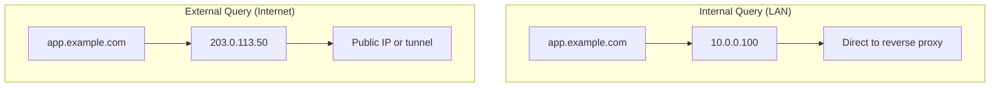
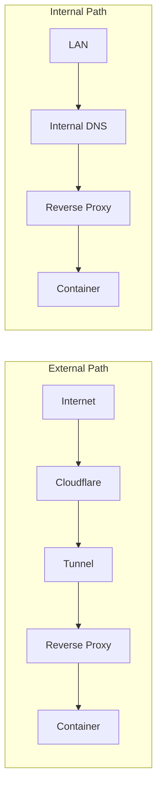
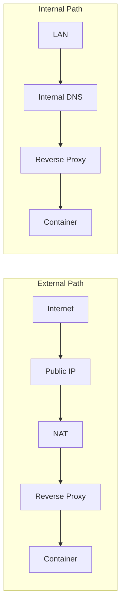

# Split-Horizon DNS

Split-horizon DNS (also called split-brain DNS) allows the same hostname to resolve to different addresses depending on where the query originates. dnsweaver makes this easy with multi-provider support.

## What Is Split-Horizon DNS?



This allows:
- Internal clients to reach services directly (faster, no hairpin NAT)
- External clients to reach services through your public endpoint
- Same hostnames work everywhere

## Basic Setup

Configure two provider instances with overlapping domain patterns:

```yaml
environment:
  - DNSWEAVER_INSTANCES=internal,external

  # Internal DNS (Technitium, Pi-hole, etc.)
  - DNSWEAVER_INTERNAL_TYPE=technitium
  - DNSWEAVER_INTERNAL_URL=http://dns-server:5380
  - DNSWEAVER_INTERNAL_TOKEN_FILE=/run/secrets/technitium_token
  - DNSWEAVER_INTERNAL_ZONE=example.com
  - DNSWEAVER_INTERNAL_RECORD_TYPE=A
  - DNSWEAVER_INTERNAL_TARGET=10.0.0.100
  - DNSWEAVER_INTERNAL_DOMAINS=*.example.com

  # External DNS (Cloudflare)
  - DNSWEAVER_EXTERNAL_TYPE=cloudflare
  - DNSWEAVER_EXTERNAL_TOKEN_FILE=/run/secrets/cloudflare_token
  - DNSWEAVER_EXTERNAL_ZONE=example.com
  - DNSWEAVER_EXTERNAL_RECORD_TYPE=CNAME
  - DNSWEAVER_EXTERNAL_TARGET=tunnel.example.com
  - DNSWEAVER_EXTERNAL_DOMAINS=*.example.com
```

When container `app.example.com` starts:
- Internal DNS → `A` record → `10.0.0.100`
- External DNS → `CNAME` record → `tunnel.example.com`

## Internal-Only Services

Some services should only be accessible internally. Use exclusion patterns:

```yaml
environment:
  - DNSWEAVER_INSTANCES=internal,external

  # Internal DNS - all subdomains
  - DNSWEAVER_INTERNAL_DOMAINS=*.example.com

  # External DNS - exclude internal-only subdomains
  - DNSWEAVER_EXTERNAL_DOMAINS=*.example.com
  - DNSWEAVER_EXTERNAL_EXCLUDE_DOMAINS=*.internal.example.com,admin.example.com
```

Now:
- `app.example.com` → records in both providers
- `db.internal.example.com` → internal only
- `admin.example.com` → internal only

## Architecture Patterns

### Pattern 1: Cloudflare Tunnel + Internal DNS



```yaml
# External: CNAME to Cloudflare Tunnel
- DNSWEAVER_EXTERNAL_TYPE=cloudflare
- DNSWEAVER_EXTERNAL_RECORD_TYPE=CNAME
- DNSWEAVER_EXTERNAL_TARGET=abc123.cfargotunnel.com

# Internal: A record to reverse proxy
- DNSWEAVER_INTERNAL_TYPE=technitium
- DNSWEAVER_INTERNAL_RECORD_TYPE=A
- DNSWEAVER_INTERNAL_TARGET=10.0.0.100
```

### Pattern 2: Public IP + Internal IP



```yaml
# External: A record to public IP
- DNSWEAVER_EXTERNAL_TYPE=cloudflare
- DNSWEAVER_EXTERNAL_RECORD_TYPE=A
- DNSWEAVER_EXTERNAL_TARGET=203.0.113.50

# Internal: A record to private IP
- DNSWEAVER_INTERNAL_TYPE=technitium
- DNSWEAVER_INTERNAL_RECORD_TYPE=A
- DNSWEAVER_INTERNAL_TARGET=10.0.0.100
```

### Pattern 3: Different Subdomains

Different subdomain schemes for internal vs external:

```yaml
# Internal: *.home.example.com → 10.0.0.100
- DNSWEAVER_INTERNAL_DOMAINS=*.home.example.com

# External: *.example.com (excluding .home) → tunnel
- DNSWEAVER_EXTERNAL_DOMAINS=*.example.com
- DNSWEAVER_EXTERNAL_EXCLUDE_DOMAINS=*.home.example.com
```

## Complete Example

Full Docker Compose with split-horizon:

```yaml
services:
  dnsweaver:
    image: maxamill/dnsweaver:latest
    environment:
      - DNSWEAVER_LOG_LEVEL=info
      - DNSWEAVER_INSTANCES=internal,external

      # Internal: Technitium for LAN
      - DNSWEAVER_INTERNAL_TYPE=technitium
      - DNSWEAVER_INTERNAL_URL=http://dns.lan:5380
      - DNSWEAVER_INTERNAL_TOKEN_FILE=/run/secrets/technitium_token
      - DNSWEAVER_INTERNAL_ZONE=example.com
      - DNSWEAVER_INTERNAL_RECORD_TYPE=A
      - DNSWEAVER_INTERNAL_TARGET=10.0.0.100
      - DNSWEAVER_INTERNAL_DOMAINS=*.example.com

      # External: Cloudflare with proxy
      - DNSWEAVER_EXTERNAL_TYPE=cloudflare
      - DNSWEAVER_EXTERNAL_TOKEN_FILE=/run/secrets/cloudflare_token
      - DNSWEAVER_EXTERNAL_ZONE=example.com
      - DNSWEAVER_EXTERNAL_RECORD_TYPE=CNAME
      - DNSWEAVER_EXTERNAL_TARGET=tunnel.example.com
      - DNSWEAVER_EXTERNAL_DOMAINS=*.example.com
      - DNSWEAVER_EXTERNAL_EXCLUDE_DOMAINS=*.internal.example.com,*.home.example.com
      - DNSWEAVER_EXTERNAL_PROXIED=true
    volumes:
      - /var/run/docker.sock:/var/run/docker.sock:ro
    secrets:
      - technitium_token
      - cloudflare_token

  # Example app - gets records in both DNS providers
  webapp:
    image: nginx
    labels:
      - "traefik.http.routers.webapp.rule=Host(`webapp.example.com`)"

  # Internal-only app - only internal DNS
  database-ui:
    image: adminer
    labels:
      - "traefik.http.routers.dbui.rule=Host(`db.internal.example.com`)"

secrets:
  technitium_token:
    file: ./secrets/technitium.txt
  cloudflare_token:
    file: ./secrets/cloudflare.txt
```

## Verification

Test that both DNS providers have correct records:

```bash
# Query internal DNS
dig @10.0.0.53 webapp.example.com

# Query external DNS (Cloudflare)
dig @1.1.1.1 webapp.example.com
```

## Troubleshooting

### Records Only in One Provider

Check domain patterns match:

```bash
docker logs dnsweaver 2>&1 | grep "webapp.example.com"
```

### Exclusion Not Working

Verify exclusion patterns are correct:

```yaml
# ✅ Correct - pattern matches subdomains
EXCLUDE_DOMAINS=*.internal.example.com

# ❌ Wrong - won't match subdomains
EXCLUDE_DOMAINS=internal.example.com
```
